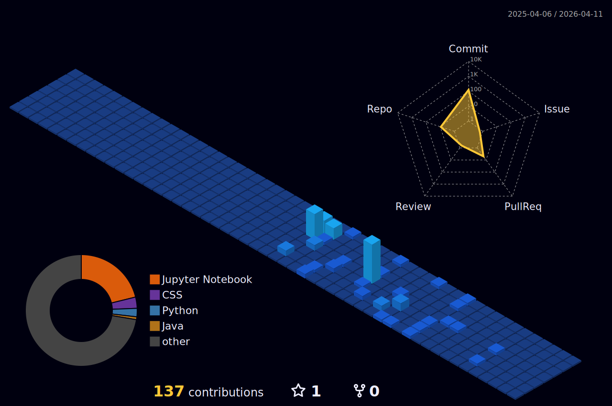
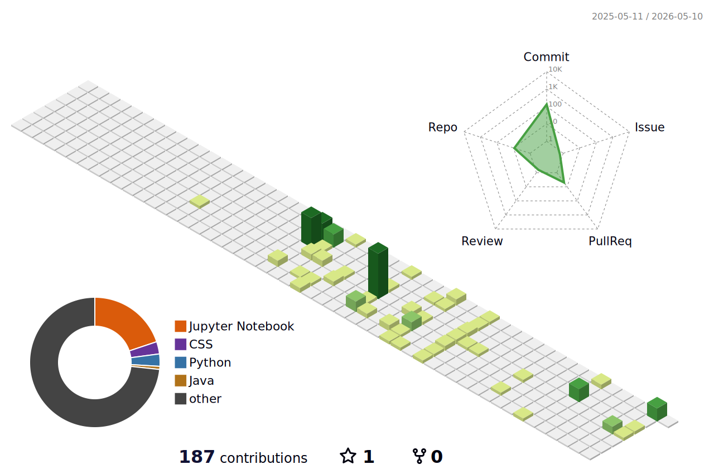
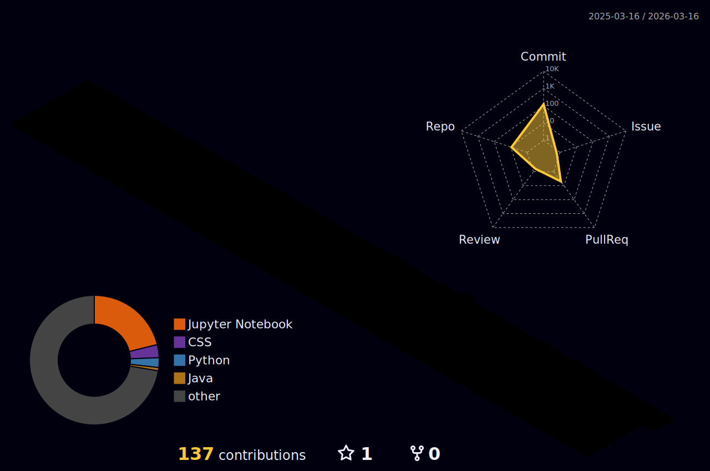

 <h1> K!shore v²</h1>  

- 🔭 I’m currently working on ERP Application for small Finance...
- 🌱 I’m currently learning Data Science...
- 👯 I’m looking to collaborate on Front devs...
- 📫 How to reach me: kishorevv12@gmail.com
- 😄 Pronouns: He/Him...
- ⚡ Fun fact: loading...

<!--

  

  

-->

  

<picture>
  <source media="(prefers-color-scheme: dark)" srcset="https://raw.githubusercontent.com/kishorevv1207/kishorevv1207/output/github-contribution-grid-snake-dark.svg">
  <source media="(prefers-color-scheme: light)" srcset="https://raw.githubusercontent.com/kishorevv1207/kishorevv1207/output/github-contribution-grid-snake.svg">
  
</picture>

  

  

<!--  -->

<!-- OR Rainbow Theme  -->

<!-- OR Night Theme -->
