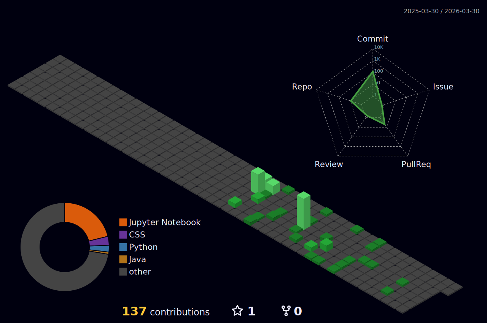

## Hi This is K!shore v²

- 🔭 I’m currently working on ERP Application for small Finance...
- 🌱 I’m currently learning Data Science...
- 👯 I’m looking to collaborate on Front devs...
- 📫 How to reach me: kishorevv12@gmail.com
- 😄 Pronouns: He/Him...
- ⚡ Fun fact: loading...

<picture>
  <source media="(prefers-color-scheme: dark)" srcset="https://raw.githubusercontent.com/kishorevv1207/kishorevv1207/output/github-contribution-grid-snake-dark.svg">
  <source media="(prefers-color-scheme: light)" srcset="https://raw.githubusercontent.com/kishorevv1207/kishorevv1207/output/github-contribution-grid-snake.svg">
  
</picture>

<!-- Green Theme -->

<!-- OR Rainbow Theme -->

<!-- OR Night Theme -->

 Github contributions:

<!-- <h4 align="center">My contribution graph</h4>

  
 
-->

<h4 align="center">Watch my contribution graph get eaten by the snake 🐍</h4>

  
 
<h4 align="center">Isometric view of contributions in the last year.</h4>
	  

	

 

  

