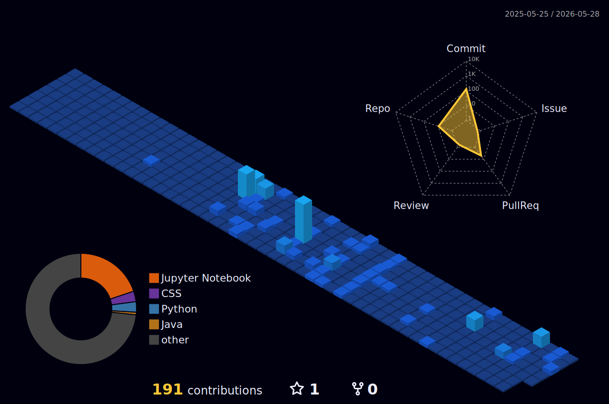

 <h1> K!shore v²</h1>  

<table width="100%">
 
<tr>
<td width="50%" valign="top">

<!-- Snake Animation -->
<picture>
<source media="(prefers-color-scheme: dark)" srcset="https://raw.githubusercontent.com/kishorevv1207/kishorevv1207/output/github-contribution-grid-snake-dark.svg">
<source media="(prefers-color-scheme: light)" srcset="https://raw.githubusercontent.com/kishorevv1207/kishorevv1207/output/github-contribution-grid-snake.svg">

</picture>

 

<pre>
Details = [
 {
    'Name': 'Kishore',
    'Role': Application Developer',
    'Skills': 'PyDev'
    'Connect': {
- Email: kishorevv12@gmail.com
- LinkedIn: [https://www.linkedin.com/in/kishore-vv](https://www.linkedin.com/in/kishore-vv)
- LeetCode: [https://leetcode.com/kishorevv](https://leetcode.com/kishorevv)
    },
    'Education': 'Electronics and Communication Engineer'
}
]
</pre>

</td>
<td width="50%" valign="top">

<!-- 3D Graph -->

 

 

<!-- Streak Stats -->

</td>

</tr>
</table>
